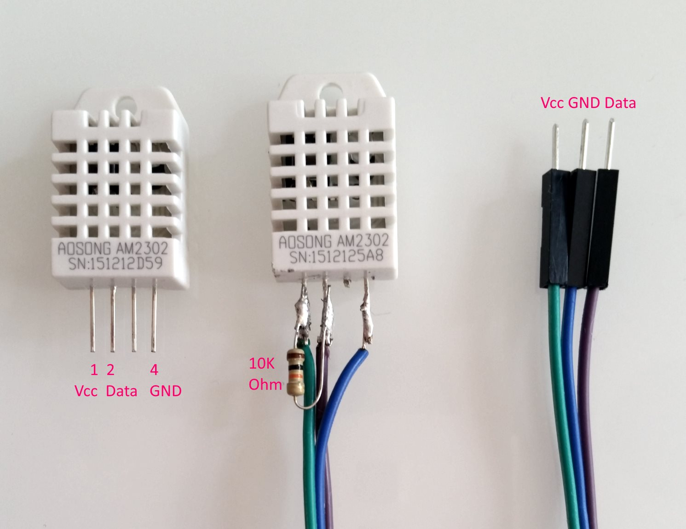

### 08. DHT22 - Temperature/Humidity Sensor (`08_Temp_DHT22`)

In this exercise we will:
* Connect an actual temperature and humidity sensors.
* Learn about DHT22 sensor.
* Push sensor readings to the web app.
* Apply some refactor to the previous device code in order to improve the app architecture.

The web app version from `06_JSON_2Relay_App` will be used.
The device code is in `08_Temp_DHT22`.

### After the refactoring

Up until now most of the code was more procedural C than object oriented C++. Also our solution now is capable of handling many endpoint types.

ToDo

### Running the device sketch

```
[MainApp] Connecting to IoT_Network
..
[MainApp] WiFi connected
[MainApp] IP: 192.168.2.148
[MainApp] Starting...
[MainApp] Sending DeviceDescription...
[HTTP] Connecting to http://iot-remotecontrol-2.azurewebsites.net/api/device/register
[HTTP] Payload: {"deviceId":"my_device_id","features":[{"type":"switch","port":4},{"type":"switch","port":5},{"type":"led","port":1},{"type":"led","port":2},{"type":"led","port
":3}]}
[HTTP] POST... response code: 200, description:
[MainApp] Started.
```

You can control the device from the test web app: http://iot-remotecontrol-2.azurewebsites.net/

### New Hardware Part: DHT-22 - Humidity and Temperature Sensor

The DHT-22 is a low cost humidity and temperature sensor with a single wire digital interface.

#### Hardware

DHT-22 Specs:
* 3.3-6V Input
* 1-1.5mA measuring current
* 40-50 uA standby current
* Humidity from 0-100% RH
* -40 - 80 degrees C temperature range
* +/- 2% RH accuracy
* +/- 0.5 degrees C



DHT-22 pins from left to right:

Pin | Function
----|----------
1   | Vcc - power supply (3.3V)
2   | Data - signal
3   | NULL (not used)
4   | GND

The `Data` pin needs to be connected to `Vcc` via a pull up resistor (10K Ohm).

Link to the [online store 1](http://elty.pl/pl/p/Czujnik-wilgotnosci-DHT22-AM2302/285) and [online store 2](https://botland.com.pl/content/142-arduino-i-obsluga-czujnika-temperatury-i-wilgotnosci-dht22).

#### Library

There are few libraries to work with the DHT-22 sensor. The [DHT sensor library](http://platformio.org/lib/show/19/DHT%20sensor%20library) from Adafruit works and is well documented.

Open the provided link to view an example how to use it.

#### Exercise

Push humidity/temperature readings to web app:
  * Connect the DHT22 sensor:
    * Use GPIO pin `12` to connect DHT-22 data pin.
    * Connect `Vcc` to `+3.3V` voltage.
  * Install library via *Library Manager*: `platformio lib install "DHT sensor library"`.
  * Add the relevant `DHT22FeatureController` class and register them in `MainApp` constructor.
    * Notice we have one feature controller to measure both temperature and humidity.
    * Use the controller class `Loop()` method to read the sensor and send out messages to topic `sensor`.
    * Use port `6`.
  * Push the data every 10 seconds. Use the `TimeUtil::IntervalPassed()` method to avoid blocking the application loop.
  * Ideally make readings of humidity and temperature and send message sending with a different time offset.  
  * The web app already understands `temperatureSensor` and `humiditySensor` feature types.

To recall from laboratory `06_JSON_2Relay`, the temperature/humidity sensor reading JSON are:

```json
{
	"type": "temperatureSensor",
	"port": 6,
	"deviceId": "my_device_id",
	"temperature": 23.5
}
```

```json
{
	"type": "humiditySensor",
	"port": 6,
	"deviceId": "my_device_id",
	"humidity": 43.4
}
```
