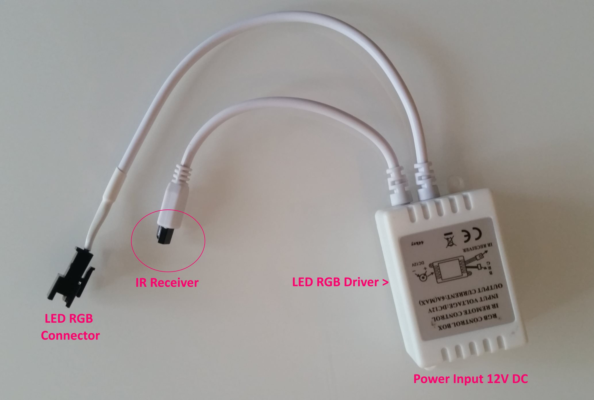
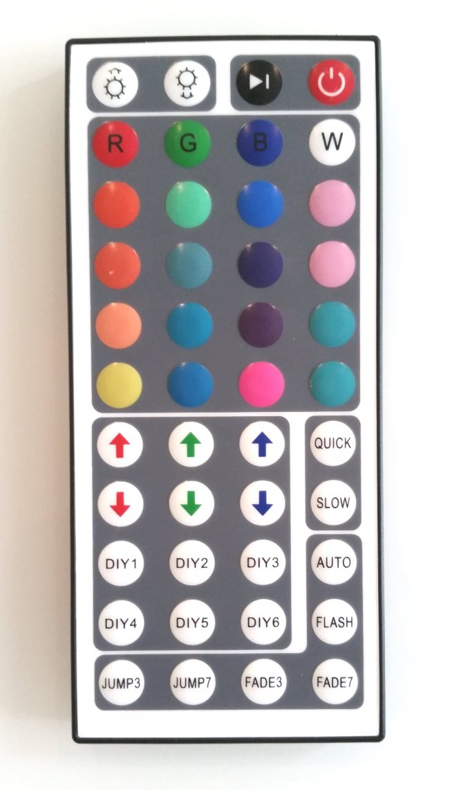

### 12. Infra-Red Transmitter (`12_IR`)

In this exercise we will connect an IR receiver and IR transceiver. We will send IR signals to drive an IR LED RGB driver.



First we have to read signals from the IR LED RGB driver's remote to understand what IR signal each key generates.



There are other types of devices that use IR communication:
* TV
* HiFi Amplifier
* DVD
* AC Control

The same technique applies if we wanted to control our TV from our IoT solution.
For example our home system could turn the TV on, dim the LED lights, so that you can enjoy your favorite TV show.

Conversely this also allows to read signals from any remote (TV, AC) into our IoT solution.

### New Hardware Part - IR Receiver TSOP4838 38kHz


Specs:
* Input: 4.5V - 6V
* Average current: 5mA
* Frequency: 38kHz

According to the manufacturer specs we need to add 100 Ohm resistor to the `Vcc` pin.

Approximate cost: 2.70 PLN.
The part comes from [here](https://botland.com.pl/odbiorniki-podczerwieni/1047-odbiornik-podczerwieni-tsop4838-38khz-.html).

Connections:
* `Out` - outputs the IR signal. This will be connected to ESP GPIO pin.

### New Hardware Part - Transceiver IR TSAL6400 5mm 940nm


Specs:
* Wave length: 940nm

220 Ohm resistor was added to limit the current on the IR LED.

Approximate cost: 0.70 PLN.
The part comes from [here](https://botland.com.pl/diody-ir-podczerwone/1059-nadajnik-ir-5-mm-940-nm-tsal6400.html).

Connections:
* `In` - Connected to ESP GPIO pin and will emit the IR signal pattern.

### Connecting the Hardware

Lets hook up the hardware.

ToDo

GIPO | What
-----|------
2    | IR Receiver (purple wire)
15   | IR Transceiver (purple wire)

### Library

The [IRremoteESP8266](http://platformio.org/lib/show/1089/IRremoteESP8266) library allows us to send and receive infra-red signals. There are few IR industry standards and the library handles most of them.


### Exercise

1. Handle the IR receiver and output all signals into serial monitor.
  * Use the sample `IRrecvDump.ino` from the IR library.
  * Add `IRInFeatureController` class.
  * Override the `void Loop()` of the `FeatureController`.
  * Set feature type as `ir_in`.
  * Register on port 8 and use GPIO pin from table above.
  * Just write the recorded IR code (in hex) and code type (no need to send to web app).

2. Handle the IR transceiver:  
  * Use the sample `IRsendDemo.ino` from the library.
  * Add `IROutFeatureController` class.
  * Override the `virtual void Handle(JsonObject& command)`.
  * Set feature type as `ir_out`.
  * Register on port 9 and use GPIO pin from table above.
  * Sample command JSON from web-app is below.

  ```json
  {
  	"type": "ir_out",
  	"port": 9,
  	"codeType": "NEC",
  	"codeData": [{
  		"bits": 32,
  		"data": 16712445
  	},
  	{
  		"bits": 0,
  		"data": 4294967295
  	}]
  }
  ```

### Reference

* [Arduino JSON - API Reference](https://github.com/bblanchon/ArduinoJson/wiki/API-Reference)
* [IRremoteESP8266 - Examples](http://platformio.org/lib/show/1089/IRremoteESP8266/examples)
