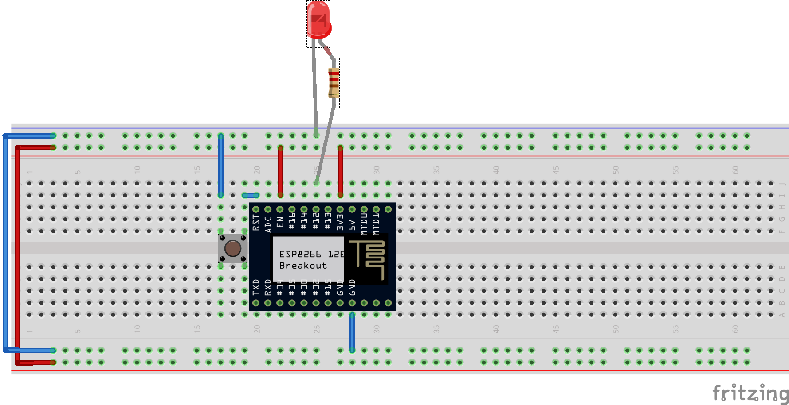

## Intro

Workshop materials for the IoT hand-on training. The training was first done at the [TWF 2016 Conference](http://twf.community).
If any questions please email me.

#### Resources

* [ESP8266 Community Forum](http://www.esp8266.com/)
* [Arduino core for ESP8266 WiFi chip](https://github.com/esp8266/Arduino)
* [Arduino Reference](https://www.arduino.cc/en/Reference/HomePage)
* [esp8266-wiki](https://github.com/esp8266/esp8266-wiki/wiki)

#### Prerequisites

##### Software

Ensure you have these installed:
* [PlatformIO](http://platformio.org/) IDE for the IoT device
* [Visual Studio 2015 Community](https://www.visualstudio.com/en-us/products/visual-studio-community-vs.aspx) IDE for the control app

##### Hardware

The training requires these parts:
* Chip
	* Module WiFi ESP-12E ESP8266 Black - 11 GPIO, ADC, PCB antenna
	* Adapter board ESP8266 ESP-12 / 12E / 12F / 07
* USB-UART (flasher)
	* Converter USB-UART PL2303 - microUSB slot
	* MicroUSB cable B - A - Esperanza - 0,8m
* Sensors
	* Motion detector PIR HC-SR501
	* Transmitter IR LIRED5C-850 5mm 850nm
	* Infrared Receiver TSOP4838 - 38 kHz
	* Humidity detector DHT22 AM2302
	* Module with 2 relays (photooptic isolation)
* Power
	* Stabilizer LDO 3,3V LF33CV - THT TO220
	* Power adapter 5V / 1,2A - DC 5,5/2,5mm
* Other stuff
	* Breadboard
	* Male wires
	* 3x LEDs (red, yellow, green)
	* 3x 220&#937; resistor
* Computer (PC, MAC?)

### Legal Note
1. This material is provided as is.
2. The author is not responsible for any damage this might cause ;-)


## 01_blink

This is a traditional *Hello World* sample for the *ESP8266* board and *Arduino* framework. The sample turns on/off a LED using a GPIO pin.

#### Objectives
* Learn to use PlatformIO.
* Understand the basic program structure.
* Learn how to connect ESP8266 and how to flash it.
* Learn how to use GPIO pins to drive a LED.

#### Hardware

First lets connect the hardware...



Connections of ESP8266 pins:
* `RST` of ESP8266 connected via a push switch to `LOW`.
  * When the button gets pressed it will restart our program (and the chip).
* `EN` is connected to `HIGH` to *enable* the chip.
  * The chip enters *sleep mode* if connected to `LOW` (or not connected at all).  
  * *Sleep mode* is used to lower the power consumption.
* `GND` and `3V3` is connected to `GND` and voltage `3.3V` respectively.      

The sample program will blink a LED. The LED's anode (shorter leg) is connected to `GND`, the cathode is connected via a 220&#937; resistor to the GPIO pin `#13`. The resistor is needed to limit the current on the LED (not to burn it).

#### Software

The structure of the project files comes from the [Platform IO](http://platformio.org/). The most interesting part of the sample is located in the main program file `src\Main.cpp`:

```cpp
#include <Arduino.h>

#define LED 13

void setup()
{
  // initialize LED digital pin as an output.
  pinMode(LED, OUTPUT);
}

void loop()
{
  // turn the LED on (HIGH is the voltage level)
  digitalWrite(LED, HIGH);
  // wait for a second
  delay(1000);
  // turn the LED off by making the voltage LOW
  digitalWrite(LED, LOW);
   // wait for a second
  delay(1000);
}
```

Some explanation on the code structure...

Any program should have exactly one `setup()` and `loop()` functions defined. The `setup` is executed only once - when the chip starts (when powered or reset); after that `loop` is executed repeatedly.

The `#include <Arduino.h>` brings in all the Arduino framework functions.

#### Arduino Reference
* [`pinMode(pin, mode)`](https://www.arduino.cc/en/Reference/PinMode)
* [`digitalWrite(pin, value)`](https://www.arduino.cc/en/Reference/DigitalWrite)
* [`delay(ms)`](https://www.arduino.cc/en/Reference/Delay)
* [`setup()`](https://www.arduino.cc/en/Reference/Setup)
* [`loop()`](https://www.arduino.cc/en/Reference/Loop)

#### Exercise

1. Modify the program to make the LED emit [SOS signal](https://en.wikipedia.org/wiki/SOS) (`...---...`)
  * [ ] Change the program.
2. Blink 3 LEDs one after another
  * [ ] Connect 2 more LEDs (green and yellow) to GPIO pins `#16` and `#12`.
  * [ ] Change the program.

### 02_blink_SOS

This an example for solving exercise *#1* from the *01_blink* section.

### 03_blink_3LED

This an example for solving exercise *#2* from the *01_blink* section.

### 04_wifi

ToDo
